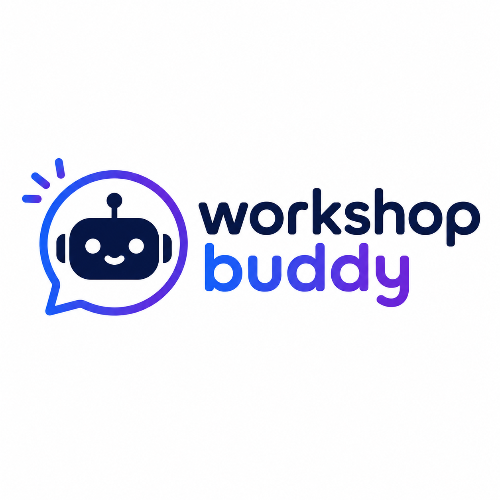

<div align="center">



# Workshop Buddy

**Delivering AI-Powered Solution Design at Enterprise Speed.**

</div>

> Turn live discovery conversations into executive-ready solution artifacts in minutes — impact statements, executive briefings, solution maps, 90-day execution plans, KPI frameworks, trend white papers, and a developer-ready **Application Spec** for vibe coding a working prototype with VS Code + GitHub Copilot.

This is the MVP demo build of Workshop Buddy. It is a single Next.js + TypeScript application backed by **Azure Database for PostgreSQL Flexible Server** (via Prisma + driver adapter, Entra-only auth) and runs locally or on Azure Container Apps.

> Hosted and maintained by **Microsoft**. Live demo: <https://workshopbuddy-app.salmonbush-45627890.eastus.azurecontainerapps.io>

---

## ✨ What's included

- Next.js 14 (App Router) + React + TypeScript + Tailwind
- Prisma ORM against **Azure Database for PostgreSQL Flexible Server** with Microsoft Entra-only authentication (`passwordAuth: Disabled`) via the `@prisma/adapter-pg` driver adapter and `@azure/identity` token refresh
- AI provider abstraction supporting **Azure AI Foundry (gpt-5.4, Entra auth)**, **Azure OpenAI**, **OpenAI**, and a deterministic **demo fallback**
- 11-agent orchestrator (Intake → Pain Points → Business Impact → Solution Concept → Architecture → KPIs → Roadmap → Executive Story → Packager → Application Spec → Review). Every agent has its own dedicated system prompt and JSON output schema — see [`agent-prompts.md`](./agent-prompts.md). The **Custom instructions** field on the Agent Workflow page is injected into every agent's user prompt for that run.
- Seven artifact outputs: **Impact Statement**, **Executive Briefing Deck**, **Solution Map**, **90-Day Execution Plan**, **Trends White Paper**, **KPI Framework**, and **Application Spec** — a developer-grade "vibe coding" brief (app type, tech stack, UI/UX principles, starter Copilot prompts, phased build plan) ready to paste into VS Code with GitHub Copilot. The Application Spec depends on the Solution Map, which is auto-included as a prerequisite when selected.
- Artifact rendering for **Markdown**, **DOCX** (`docx`), and **PPTX** (`pptxgenjs`)
- Polished AI-studio UX: dashboard, project intake wizard, workshop board, agent workflow canvas, artifact workspace with versioning and regeneration, and an in-app **Help** section
- Seed project: *OCR to GenAI Document Intelligence Modernization*
- `/api/health` endpoint, Dockerfile, and `docker-compose.yml`

---

## 🚀 Local quickstart

Requires Node.js 20+ and `az login` against the Microsoft tenant that owns the Postgres server (so `DefaultAzureCredential` can mint an Entra token).

```bash
cp .env.example .env       # (optional) set AI provider keys
npm install                # installs deps and runs `prisma generate`
npm run db:push            # pushes schema to Postgres (workshopbuddy db)
npm run db:seed            # seeds the demo project
npm run dev                # http://localhost:3000
```

The default `DATABASE_URL` in `.env` points at `pg-workshopbuddy-wus3.postgres.database.azure.com` / `workshopbuddy` with **no password** — the Prisma client picks up an Entra access token via `@azure/identity` and uses it as the Postgres password on every new pool connection (so 1h token expiry is handled transparently).

Whoever runs `npm run db:push` locally needs:

1. `az login` against the right tenant.
2. Their Entra account configured as a Postgres Entra admin on the server (currently `admin@MngEnvMCAP365575.onmicrosoft.com` and the `workshopbuddy-uami` managed identity are both Entra admins).
3. Their public IP allowed through the Postgres firewall (`deploy.ps1` adds the rule automatically; manually:
   `az postgres flexible-server firewall-rule create -g rgWorkshopBuddy -n pg-workshopbuddy-wus3 --rule-name my-dev --start-ip-address <ip> --end-ip-address <ip>`).

For `prisma db push` to authenticate, the CLI needs the token embedded in the URL:

```powershell
$t = az account get-access-token --resource https://ossrdbms-aad.database.windows.net --query accessToken -o tsv
$env:DATABASE_URL = "postgresql://admin%40MngEnvMCAP365575.onmicrosoft.com:$t@pg-workshopbuddy-wus3.postgres.database.azure.com:5432/workshopbuddy?sslmode=require"
npx prisma db push
```

Open <http://localhost:3000> and you'll see the seeded project on the dashboard. Click **Open** → **Workshop** → add inputs → **Run Full Workflow** → preview and download artifacts in **Artifacts**.

### Without AI keys

If no AI provider is configured, the studio runs in **demo mode** with deterministic synthesis grounded in the workshop inputs. Every screen — including the agent workflow and artifact downloads — works end-to-end.

### With Azure AI Foundry (gpt-5.4, Entra-only — no API keys)

This is the **recommended** path for the demo. The Foundry project at `jamesbas-demo-project-resource` (in resource group `rg-jamesbas-demo-project`) allows only Entra ID authentication.

Set in `.env`:

```bash
AI_PROVIDER=azure_foundry
AZURE_FOUNDRY_RESPONSES_ENDPOINT=https://jamesbas-demo-project-resource.services.ai.azure.com/api/projects/jamesbas-demo-project/openai/v1/responses
AZURE_FOUNDRY_MODEL=gpt-5.4
```

The app uses [`DefaultAzureCredential`](https://learn.microsoft.com/azure/developer/javascript/sdk/credential-chains) to obtain a bearer token for the `https://ai.azure.com/.default` scope. Locally that picks up `az login` / VS Code / environment credentials; in Azure Container Apps it uses the user-assigned managed identity `workshopbuddy-uami`, which the Bicep template grants **Cognitive Services User** on the Foundry account.

### With Azure OpenAI (key-based)

```bash
AI_PROVIDER=azure_openai
AZURE_OPENAI_ENDPOINT=https://<your-resource>.openai.azure.com
AZURE_OPENAI_API_KEY=<key>
AZURE_OPENAI_DEPLOYMENT=<deployment-name>      # e.g. gpt-4o
AZURE_OPENAI_API_VERSION=2024-08-01-preview
```

### With OpenAI

```bash
AI_PROVIDER=openai
OPENAI_API_KEY=sk-...
OPENAI_MODEL=gpt-4o-mini
```

---

## 🐳 Docker

```bash
docker compose up --build
# → http://localhost:3000
```

---

## ☁️ Azure Container Apps — one-command deploy to `rgWorkshopBuddy`

Bicep + a PowerShell wrapper provision/refresh everything in resource group **`rgWorkshopBuddy`**:

- Azure Container Registry (ACR)
- Log Analytics workspace + Container Apps environment
- User-Assigned Managed Identity (`workshopbuddy-uami`) for ACR pulls, Foundry, and Azure Postgres
- **Azure Database for PostgreSQL Flexible Server `pg-workshopbuddy-wus3`** in `westus3`, Burstable `Standard_B1ms`, 32 GB storage, PG 16, **Entra-only auth** (`activeDirectoryAuth: Enabled`, `passwordAuth: Disabled`), with database `workshopbuddy`
- Firewall rules: `AllowAzureServices` + `AllowDevWorkstation` (your current IP)
- The Container App `workshopbuddy-app`, identity-bound to the UAMI, with `DATABASE_URL` pre-wired to the Postgres FQDN (the container's `start.js` fetches an Entra access token at boot)
- RBAC: `AcrPull` on the registry + `Cognitive Services User` on the Foundry account `jamesbas-demo-project-resource` (cross-RG assignment) + **Postgres Entra admin** for the UAMI on the Flexible Server (declared via the Bicep `administrators` sub-resource — no T-SQL bootstrap required)

```powershell
# from innovate-impact/
az login
az account set --subscription <SUBSCRIPTION_ID>
./infra/deploy.ps1                                                # uses defaults (rgWorkshopBuddy, eastus container app, westus3 PG)
# or override:
./infra/deploy.ps1 -ResourceGroup rgWorkshopBuddy -Location eastus -ImageTag v1
```

The script:

1. Verifies `rgWorkshopBuddy` exists.
2. Runs `az deployment group create` on [`infra/main.bicep`](infra/main.bicep) to bootstrap ACR, the Container Apps environment, the Postgres Flexible Server + `workshopbuddy` database, and the managed identity (the UAMI is added as a Postgres Entra admin via the Bicep `administrators` sub-resource).
3. Builds & pushes the image with `az acr build` (no local Docker required).
4. Re-deploys Bicep with the new image tag to provision/update the Container App.
5. Ensures Postgres Entra admins via `az postgres flexible-server microsoft-entra-admin` (idempotent).
6. Prints the public HTTPS URL of the app, the Postgres server FQDN, and the database name.

> The deploying principal needs **Contributor** on `rgWorkshopBuddy` *and* permission to create role assignments on the Foundry resource group `rg-jamesbas-demo-project` (Owner / User Access Administrator). RBAC propagation can take a couple of minutes after the first deployment.

### How the Azure Postgres piece works

- **Server**: `pg-workshopbuddy-wus3.postgres.database.azure.com` (westus3) — declared in `infra/main.bicep` with `Microsoft.DBforPostgreSQL/flexibleServers@2024-08-01`, `activeDirectoryAuth: Enabled`, `passwordAuth: Disabled`.
- **Database**: `workshopbuddy` (UTF8 / en_US.utf8).
- **Firewall**: `AllowAzureServices` (the Container App's egress) + an optional `AllowDevWorkstation` rule with your public IP for local development.
- **App connection string**:
  ```
  postgresql://workshopbuddy-uami@pg-workshopbuddy-wus3.postgres.database.azure.com:5432/workshopbuddy?sslmode=require
  ```
  No password is embedded; the password is an Entra access token fetched at runtime by `@azure/identity` (scope `https://ossrdbms-aad.database.windows.net/.default`). The Prisma client in `src/lib/db.ts` is built with `@prisma/adapter-pg` against a `pg.Pool` whose password is an async callback — every new pool connection picks up a fresh token, so 1h token expiry is transparent.
- **Schema migrations + seed**: the container's `CMD` is `node start.js`, which (a) fetches an Entra access token, (b) injects it into `DATABASE_URL` for the Prisma CLI, (c) runs `prisma db push --accept-data-loss`, (d) runs `prisma/seed.js` (idempotent), then (e) starts the Next.js standalone server.

> **Cost saver:** the Postgres Flexible Server can be stopped (`az postgres flexible-server stop -g rgWorkshopBuddy -n pg-workshopbuddy-wus3`) when not in use. Re-run `deploy.ps1` after starting it with `... start ...` — the script will fail with `UpsertServerManagementOperationComputeOnlySupportForStoppedServer` until the server is back in **Ready** state.

### Manual / advanced

If you want to deploy with raw CLI commands instead of `deploy.ps1`, see [`infra/main.bicep`](infra/main.bicep) for all parameters. The container exposes `/api/health` for liveness / readiness probes.

---

## 🧩 Project structure

```text
src/
  app/
    page.tsx                         # Dashboard
    projects/                        # Projects, intake, detail, workshop, agents, artifacts
    workshop/  agents/  artifacts/   # Top-level shortcut pages
    help/                            # In-app user guide (facilitator playbook)
    settings/                        # Provider & demo settings
    api/                             # REST endpoints
  components/                        # AppShell, UI primitives, intake wizard, workshop, agents, artifacts
  lib/
    ai/provider.ts                   # Provider abstraction (Foundry / Azure OpenAI / OpenAI / mock)
    agents/orchestrator.ts           # 11-agent workflow + artifact packager + Application Spec agent
    agents/agent-prompts.ts          # Per-agent system prompt + JSON schema (see agent-prompts.md)
    artifacts/                       # Markdown / DOCX / PPTX renderers + schemas
    prompts/                         # System and packager prompts (Markdown)
    db.ts utils.ts
prisma/
  schema.prisma  seed.ts
public/
  workshop-buddy-logo.png            # Branding (sidebar + Help page)
  microsoft-logo.svg                 # Microsoft attribution (sidebar footer)
infra/
  main.bicep  main.bicepparam  deploy.ps1
  modules/foundry-role.bicep         # Cross-RG role assignment on Foundry
```

---

## ✅ Acceptance criteria coverage

| # | Criterion | Status |
|---|---|---|
| 1-3 | Create project, intake, workshop inputs | ✅ |
| 4-5 | Run AI workflow, persist agent run | ✅ |
| 6 | Generate Impact Statement, Briefing Deck, Solution Map, 90-Day Plan (and KPI / Trends / Application Spec) | ✅ |
| 7-8 | Preview and edit Markdown | ✅ |
| 9-10 | Download DOCX (docs) and PPTX (briefing deck) | ✅ |
| 11 | Seeded OCR to GenAI demo project | ✅ |
| 12 | `npm run dev` | ✅ |
| 13 | Docker build & run | ✅ |
| 14 | README with local + ACA deployment | ✅ |

---

## 🛡️ Notes

- AI-drafted content requires human review and approval before client use. This disclaimer appears in the UI and in every generated artifact.
- API keys are read from environment variables only and are never logged.
- The MVP intentionally omits enterprise auth, RBAC, and real-time collaboration.
- Hosted by **Microsoft**.
